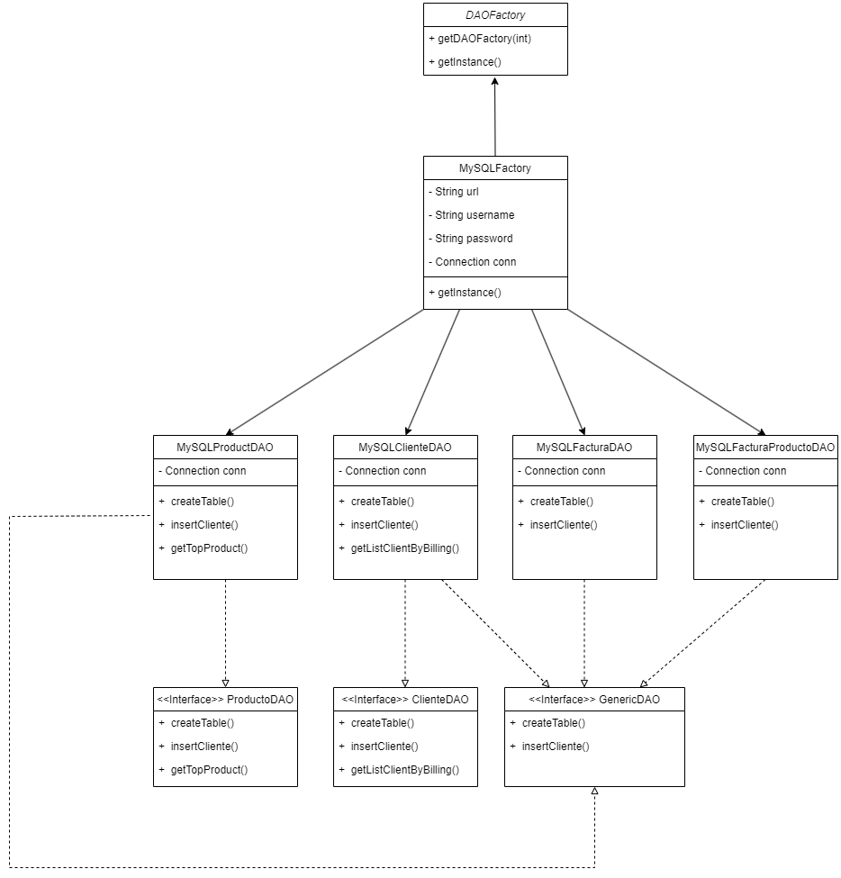

# TP Integrador 1 - Arquitecturas WEB

## Descripción del Proyecto

En este proyecto se va a abarcar las problematicas planteadas en el integrador numero uno que plantean la realizacion de un JDBC y realizar la creacion, insercion y consultar a una base de datos MySQL que se levantara con Docker.

## Diagrama de clases



## Funcionalidades

- **Creacion de tablas**: El programa se encargara de crear las tablas Producto, Cliente, Factura y FacturaProducto.
- **Insercion de registros**: El programa se encargara de realizar insert de manera masiva por medio de archivos csv en las tablas Producto, Cliente, Factura y FacturaProducto.
- **Obtener el producto con mayor recaudacion**: Por medio de una consulta el programa obtendra el producto que mas ha recaudado.
- **Lista de clientes que mas facturo**: A travez de consultas el programa podra consultar y imprimir una lista con los clientes que mas facturaron.

## Tecnologías Utilizadas

- **Java JDK-21**: Lenguage para realizar el backend de la app.
- **MySQL**: Base de datos utilizada para almacenar los datos extraidos del csv.
- **PHPMyAdmin**: Interfaz para administrar y visualizar la base de datos.
- **Docker**: Para deployar de manera local nuestra base de datos y su administrador.

## Información del Estudiante

- **Nombre y Apellido**: Luciano Oroquieta Merlino.
- **Email**: oroquietaluciano@gmail.com.
- **Sede**: Tandil.

- **Nombre y Apellido**: Matias Gatti Gonzalez.
- **Email**: matiasgatti2301@gmail.com.
- **Sede**: Tandil.

- **Nombre y Apellido**: Micaela Ayelen Linares Diaz.
- **Email**: micaelaexactas1@gmail.com.
- **Sede**: Tandil.

- **Nombre y Apellido**: Santiago Coria.
- **Email**: santiagocoria@live.com.ar
- **Sede**: Tandil.

## Instrucciones para Ejecutar el Proyecto Localmente

1. Clona este repositorio:
 ```bash
git clone https://github.com/micadiazz1/tp1-integrador-arq.git
 ```
2. Entrar al directorio:
 ```
cd ./tp1-integrador-arq/
```
3. Ejecutar la aplicacion Docker:

4. Levantar infraestructura:
```bash
docker compose up -d --build
```bash
